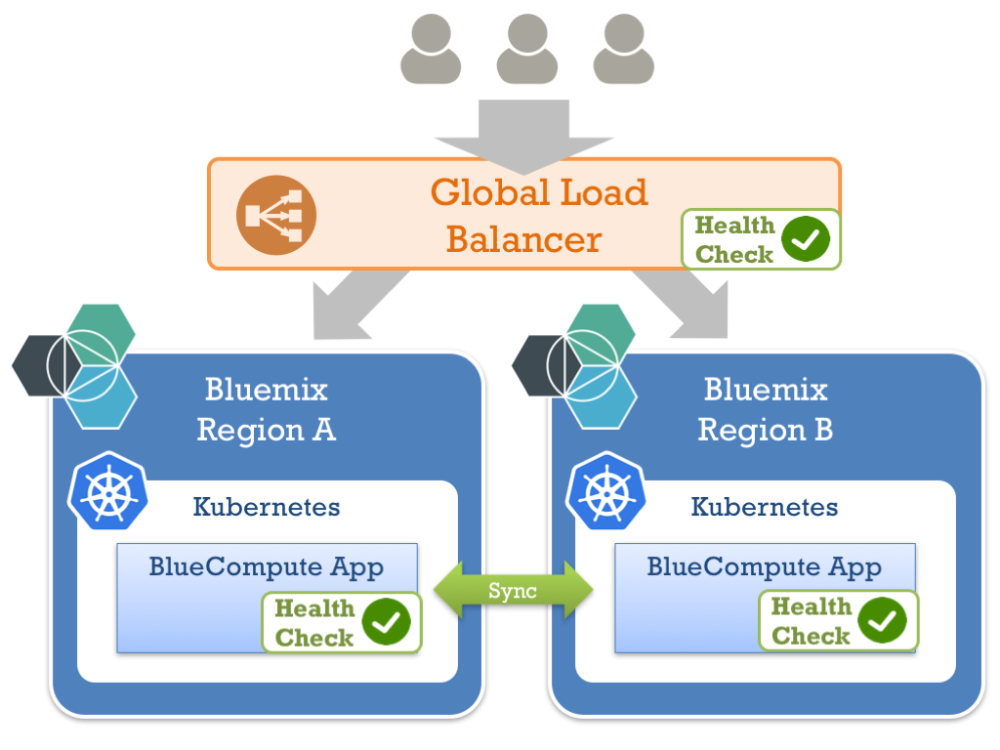

# Cloud Native High-Availability - Hands-On Lab

## Introduction

This project is a **hands-on lab** to demo how to **add basic HA to a cloud native application**.
For this lab we will add and test a [NGINX server](https://nginx.org), which will be used as a proxy and load-balance the requests between two instances of a web applications.

### Why is high-availability important for Cloud Native applications?
When it comes to applications deployed in the cloud, perhaps the most fundamental question asked about non-functional requirements is "How do I ensure that my application is still running even if something fails?"
In the cloud, you can not guarantee the availability of the different components, so you have to design for failure.

### High-availability architecture for Cloud Native
In order to secure the availability of your cloud-native application, your architecture has to take into account high-availability. Here are some architectural best practice:
* Deploy your application in multiple regions
* Use a Global Load Balancer with health-check features to direct requests only to live instances
  * For example: [Akamai Traffic Management](https://www.akamai.com/us/en/products/web-performance/global-traffic-management.jsp)
* Synchronize data between your instances
  * Using a database which support master / master synchronization (for example, [Cloudant](https://cloudant.com/) or [MySQL](https://www.digitalocean.com/community/tutorials/how-to-set-up-mysql-master-master-replication)
  * Using messages queues
* Inside an instance, check the health of your components and restart it automatically if needed
  * In a cloud native environment, your containers have to be stateless and can be killed and recreated if needed 
  * This feature can be provided by [Kubernetes Probes](https://kubernetes.io/docs/tasks/configure-pod-container/configure-liveness-readiness-probes/)


Of course, it is very important to understand the business and technical requirements for high-availability to design the right architecture. There is no "one-size fits all" solution!

## Hands-on lab description

### Hands-on lab architecture
For this limited hands-on lab, we will use a simplified architecture:
* A basic load-balancer
  * not resilient
  * limited health-check features
  * no [session persistence](http://nginx.org/en/docs/http/load_balancing.html#nginx_load_balancing_with_ip_hash) to make load balancing easier to test 
* No back-end synchronization


### Prerequisites
* [Git](https://git-scm.com/book/en/v2/Getting-Started-Installing-Git), a version control system tool
* A web application running on two different instances
  * You may for example deploy two instances of the [BlueCompute](https://github.com/ibm-cloud-architecture/refarch-cloudnative-kubernetes) reference application
* A [Kubernetes](https://kubernetes.io/) cluster
  * This hands-on lab has been tested with [Bluemix free Kubernetes cluster](https://console.bluemix.net/containers-kubernetes/launch)
* [Kubectl](https://kubernetes.io/docs/tasks/tools/install-kubectl/) command-line interface must be installed and configured
  * For Bluemix Kubernetes Cluster, check this [documentation page](https://console.bluemix.net/docs/containers/cs_cli_install.html) if needed

### Summary of the hands-on labs steps
The main steps of this lab are:
1. edit the nginx load balancing configuration file
2. deploy nginx configuration file to your kubernetes cluster
3. deploy nginx to your kubernetes cluster
4. test load balancing
5. simulate a problem with one of your application instances
6. verify that the application is still available

## 1 - Edit the nginx load balancing configuration file
* Open a terminal
* Clone this git project

```
git clone https://github.com/ibm-cloud-architecture/refarch-cloudnative-nginx
cd refarch-cloudnative-nginx
```

* Edit file "nginx.conf" with your text editor of choice
  * Replace $APP_INSTANCE1_URL and $APP_INSTANCE2_URL with your web application URLs (example: 184.172.247.213:31020)
  * For more information on this configuraton file, check the [nginx load balancing documentation](http://nginx.org/en/docs/http/load_balancing.html)
  
## 2 - Deploy nginx configuration file to your kubernetes cluster
* Load the nginx configuration as [Kubernetes ConfigMap](https://kubernetes.io/docs/tasks/configure-pod-container/configmap/):
  * Because containers must be immutable, it is a good practice to not include the configuration directly in the container. ConfigMaps allow you to decouple configuration artifacts from image content to keep containerized applications portable.

```bash
kubectl create configmap nginx-config --from-file=nginx.conf
```

## 3 - Deploy nginx to your kubernetes cluster

* [Create](https://kubernetes.io/docs/user-guide/kubectl/v1.5/#create) the nginx server using the "nginx-pod.yaml" configuration file
```bash
kubectl create -f nginx-pod.yaml
```

* [Expose](https://kubernetes.io/docs/user-guide/kubectl/v1.5/#expose) the nginx server as a service
```bash
kubectl expose po nginx --type=NodePort
```

* Obtain the nginx public url
  * This command combines "kubectl get services" and "kubectl get nodes" to obtain the ip address and port of the nginx server
```bash
( kubectl get nodes | grep -v NAME | awk '{print $1}'; echo ":"; kubectl get services | grep nginx | sed 's/.*:\([0-9][0-9]*\)\/.*/\1/g') | sed -e ':a' -e 'N' -e '$!ba' -e 's/\n//g'
```

## 4 - Test load balancing
* Copy the result of the previous command in your browser address bar.
* You should reach one of your 2 application instances
* If you reload your application multiple times, you should see both the first and second instances of your application as the nginx load balancer distributes the requests.
  * If you are using the BlueCompute Application, you will see on the homepage the cluster and region where the application is deployed. So you will be able to verify which instance provided the response
  


## 5 - Simulate a problem with one of your application instance
* Switch off one your application instance
  * If you are using the BlueCompute application on Kubernetes, you can switch off one instance by reducing the number of instances of the web server to 0
  
```bash
kubectl scale --replicas=0 deploy/bluecompute-web-deployment
```

## 6 - Validate continuity
* Go back to your web browser and retry 
* After a few seconds, the page should load  
